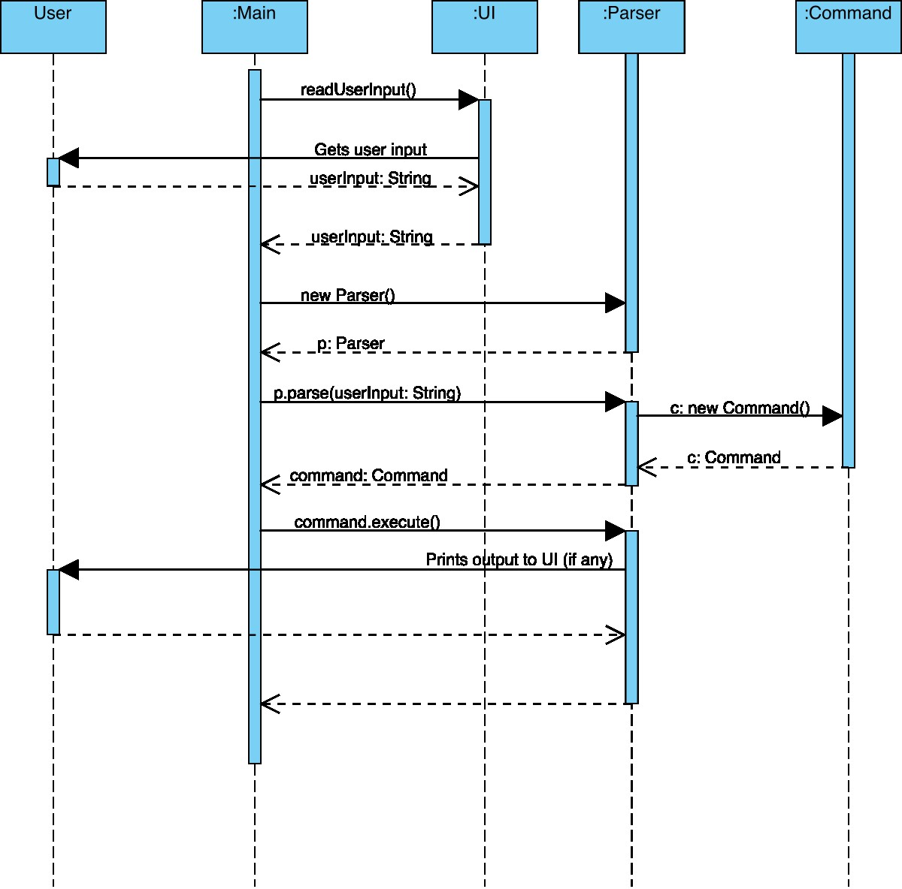

# Developer Guide

## Acknowledgements

{list here sources of all reused/adapted ideas, code, documentation, and third-party libraries -- include links to the original source as well}

## Design

### Architecture

The bulk of the app's work is done by the following three components:
- `UI`: The UI of the App.
- `Parser`: Formats the user's input
- `Command`: Command's logic and execution

### UI component

The `UI` consists of a `Scanner` and an `OutputStream` object. Together, these objects abstract the functionalities of
obtaining user input and providing feedback (output printed in terminal UI). The `UI` component provides a simple
interface for other components to interact with the user.

The `UI` component:
- provides a method to obtain user input.
- provide methods to print output in tabular format

### Parser component

### Command component
### UI component

The `UI` consists of a `Scanner` and an `OutputStream` object. Together, these objects abstract the functionalities of
obtaining user input and providing feedback (output printed in terminal UI). The `UI` component provides a simple
interface for other components to interact with the user.

The `UI` component:
- provides a method to obtain user input.
- provide methods to print output in tabular format

### Parser component

### Command component
The Command component consists of the individual command objects (listed in table below) and an abstract
class `Command`. The `Command` component is responsible for executing the commands after it has been parsed by `Parser`.
All error handling is handled here and any errors/output would be passed to the `UI` component for printing and
formatting of the output.

| Command                  | Purpose                                    |
|--------------------------|--------------------------------------------|
| AddExpenseCommand        | Add a new Expense transaction              |
| AddIncomeCommand         | Add a new Income transaction               |
| CategoryCommand          | Add/Remove a Category (used for expense)   |
| ExitCommand              | Exit the program                           |
| GoalCommand              | Add/Remove a Goal (used for income)        |
| HelpCommand              | Gives usage format information to the user |
| ListCommand              | Lists all incoming/outgoing transactions   |
| RemoveTransactionCommand | Deletes a transaction                      |

## Implementation

### [Proposed] Export feature

#### Proposed Implementation

The proposed export feature is facilitated by `File`. It implements the following operation:
- `File#exportTransaction()` - Exports all the transactions that is stored into a CSV format.

Given below is an example usage scenario and how the export features behaves at each step.

Step 1. The user launches the application for the first time. There would be no transactions available to be exported.

Step 2. The user executes `in part-time job /amount 500 /goal car` to create a transaction with the description of `part-time job`, with the `amount` set to `500` and `goal` set to `car` and stores it in the program

Step 3. So when the user executes `export`, it will get all the transactions that the program stored and exports to a CSV file using OpenCSV 

## Product scope
### Target user profile

{Describe the target user profile}

### Value proposition

{Describe the value proposition: what problem does it solve?}

## User Stories

|Version| As a ... | I want to ... | So that I can ...|
|--------|----------|---------------|------------------|
|v1.0|user|add a new income source|can keep track of my allowances and part-time job earnings|
|v1.0|user|add an expense|can monitor my purchases and stay within my budget|
|v1.0|user|delete a transaction|remove any duplicate or unwanted entries from my expenses|
|v1.0|user|view a list of all my transactions|review my income and expenses|
|v2.0|user|export financial data to a CSV file|use it for client presentations and analysis|
|v2.0|user|set up recurring transactions for mortgage payments and utility bulls|easily track and budget for regular home expenses|
|v2.0|user|set financial goals, such as saving for a down payment on a house|stay motivated and track my progress towards home ownership.|

## Non-Functional Requirements

{Give non-functional requirements}

## Glossary

* *glossary item* - Definition

## Instructions for manual testing

{Give instructions on how to do a manual product testing e.g., how to load sample data to be used for testing}
