# Developer Guide

## Acknowledgements

1. [OpenCSV](https://mvnrepository.com/artifact/com.opencsv/opencsv)
2. [Apache Common IO](https://mvnrepository.com/artifact/commons-io/commons-io)

## Design

### Architecture

The bulk of the app's work is done by the following five components:
- `UI`: The UI of the App.
- `Parser`: Formats the user's input.
- `Command`: Command's logic and execution.
- `Storage`: Storage of data of the App.
- `StateManager`: Common source of truth for program.

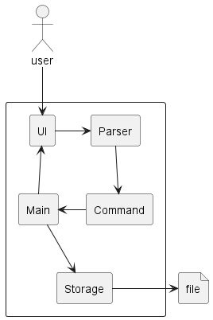

### UI component

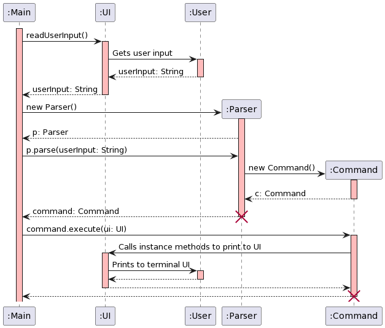
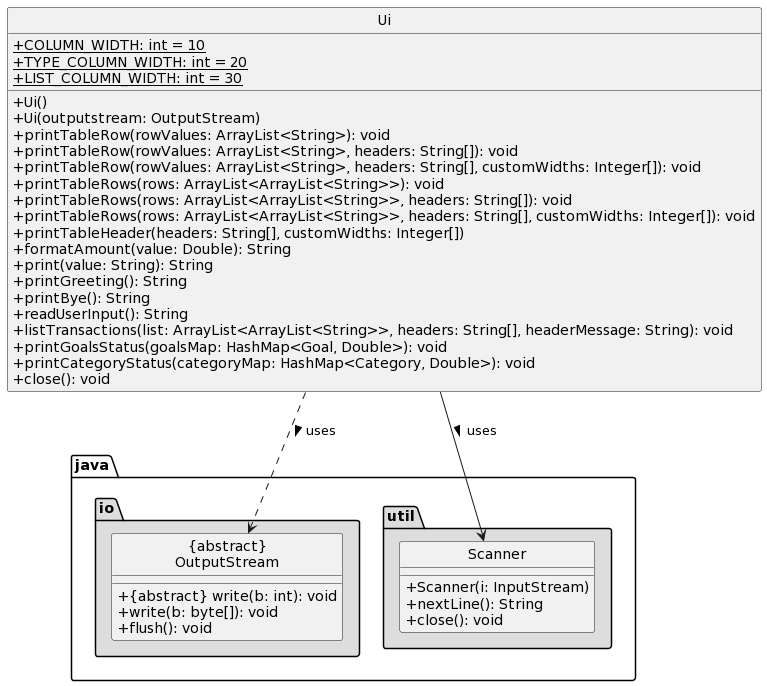

The `UI` consists of a `Scanner` and an `OutputStream` object. Together, these objects abstract the functionalities of
obtaining user input and providing feedback (output printed in terminal UI). The `UI` component provides a simple
interface for other components to interact with the user.

The `UI` component:
- provides a method to obtain user input.
- provide methods to print output in tabular format

### Parser component

The `Parser` functionality is to take in a user input, parse it and return the relevant `Command` object based on 
the input.

How the `Parser` works:
1. When the user input any string, it will be passed to a newly constructed `Parser` object.
2. The `parse` function in the `Parser` will be called to extract the command word, description and arguments of the 
command if any.
3. These parsed details will then be passed to the relevant `Command` object based on the command word.
4. Afterward, the `Command` object will be passed back to `Main` for execution.

Note: The `Parser` will not do any validation of arguments or description of the command. Those will be handled by the 
respective `Command` object.

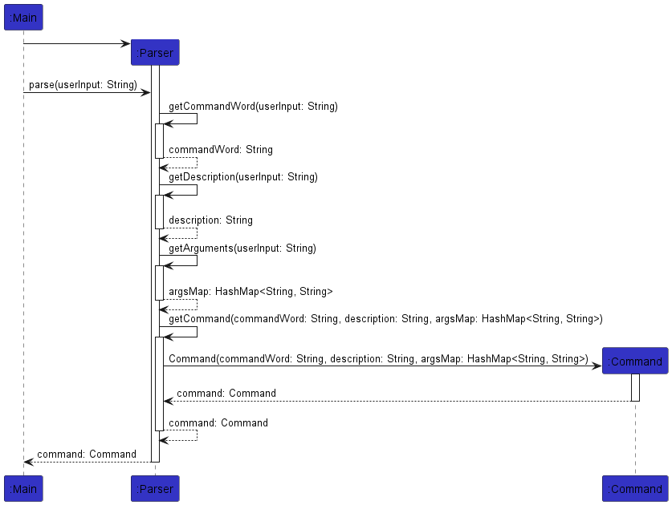

### Command component

The Command component consists of the individual command objects (listed in table below) and an abstract
class `Command`. The `Command` component is responsible for executing the commands after it has been parsed by `Parser`. \
All error handling is handled here and any errors/output would be passed to the `UI` component for printing and
formatting of the output.

| Command Class            | Purpose                                        |
|--------------------------|------------------------------------------------|
| AddExpenseCommand        | Add a new Expense transaction                  |
| AddIncomeCommand         | Add a new Income transaction                   |
| CategoryCommand          | Add/Remove a Category (used for expense)       |
| ExitCommand              | Exit the program                               |
| GoalCommand              | Add/Remove a Goal (used for income)            |
| HelpCommand              | Gives usage format information to the user     |
| ListCommand              | Lists all incoming/outgoing transactions       |
| ExportCommand            | Exports transactions data into CSV FIle        |
| RemoveTransactionCommand | Deletes a transaction                          |
| EditTransactionCommand   | Edits an income/expense transaction            |
| SummaryCommand           | Summarise the total income/expense transaction |

### Storage component
The `Storage` functionality is to load data from the storage files (`category-store.csv` , `expense-store.csv`, `goal-store.csv`, `income-store.csv`) into the application. It will also store any data while the application is running.

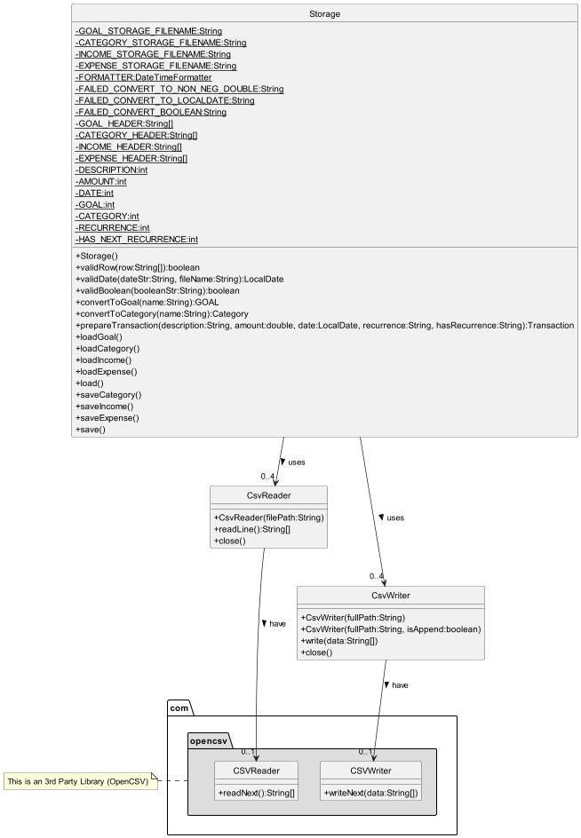

The `Storage` component:
- Loads previous state of application when the program is booted up
- Skips any rows that are invalid during the validation phase
- Saves to storage file after each command is completed
- Uses `CsvWriter` and `CsvReader` class to read and write to the storage files.
- `CsvWriter` and `CsvReader` uses `CSVWriter` and `CSVReader` respectively from OpenCSV library to write and read from CSV Files 

### StateManager component
The `StateManager` component provides the program with a single source of truth. `StateManager`'s design follows the singleton design pattern, allowing
only a single instance to be declared throughout the program. Thus, the constructor is explicitly set to private - this is by design.

In order to get the instance of `StateManager` in the program, `StateManager#getStateManager()` should be used.

The `StateManager` component keeps tracking of the income, expenses, goals and categories added to the program. Each entity
is tracked with a corresponding `ArrayList`. `StateManager` also provides the following general utility methods for easy retrieval of data:
- `Storage#addEntity(Entity)` - Add an instance of entity to be tracked
- `Storage#getEntity(int): Entity` - Gets an instance of the entity by index (0-based).
- `Storage#removeEntity>(Entity)` - Removes the provided entity from the corresponding `ArrayList`
- `Storage#removeEntity(int)` - Removes the entity by index (0-based)
- `Storage#getAllEntity(): ArrayList<Entity>`

**Note:** Entity is a placeholder for `Income`, `Expense`, `Goal` and `Category`.

The `StateManager` also contains other methods for managing objects in the state. However, we will not delve into these
more application-specific methods in this section.

## Common Classes
### Income Class
Income class is used to store information about the savings of the user. It is implemented by aggregating 
Transaction and Goal classes. Each income is linked to one transaction and goal. The goal specifies a target to which the user 
is saving towards.

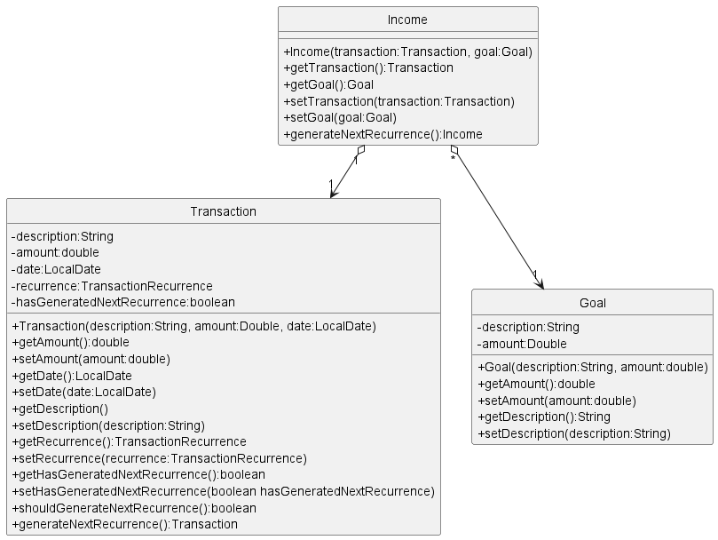

### Expense Class
Expense class is used to store information about the spending of the user. It is implemented by aggregating  
Transaction and Category classes. Each expense is linked to one transaction and category. The category is used for 
grouping related expenditures such as Food, Transport, School Fees, etc.

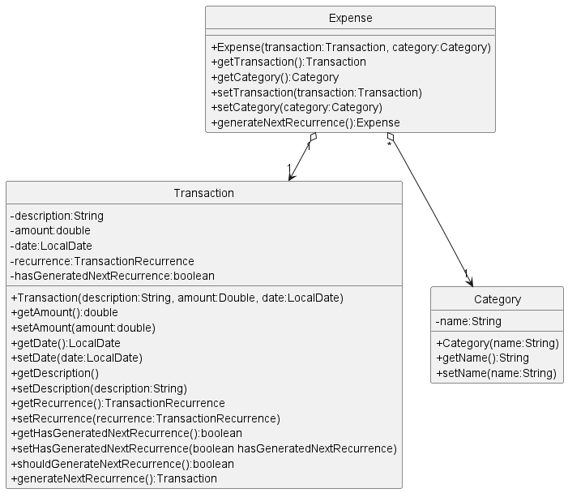

## Implementation

### Transaction tracking feature

Transaction tracking is a core functionality in the program. This feature includes two commands `in` and `out` which gives users
the ability to add income or expenses respectively. Also, the user is able to associate an income entry with a goal or have an expense
entry be associated to a category of expenditure.

The following functionalities are implemented in `AddIncomeCommand` and `AddExpenseCommand` and its' parent class `AddTransactionCommand`.

An example of the usage of the `in` and `out` command can be found in the [User Guide](https://ay2324s1-cs2113-w12-3.github.io/tp/UserGuide.html).

When a user attempts to add an income or expense entry, the user's input will be validated first to ensure that:
- Description, used to denote information about the transaction entry, is not blank
- Amount is a decimal value that is non-negative.
  - 0 is allowed - Possible use case would be to add a placeholder entry that can be later edited to reflect actual amount.
- Date, if provided, will be verified to ensure validity (`ddMMyyyy` format).
- Recurrence, if provided, is of a valid value (case-insensitive)
  - Valid values are `daily`, `weekly`, `monthly` and `none`.
  - Date, if provided, is additionally verified to ensure that it is not more than or equal to 1 period in the past, relative to current system time.

If any of the above validation fails, an error message relevant to the failure will be printed to inform the user and hint the corrections required.

For attempts to add an income entry, the command will additionally verify that the goal (if specified) already exists in the program. Otherwise,
an error will be returned.

Once a user's inputs are verified and deemed valid, a `Transaction` object is prepared through a call to `AddTransactionCommand#prepareTransaction()`. The returned `Transaction` object is encapsulated together with a corresponding `Goal` or `Category` object in an `Income` or `Expense` object as required.

These prepared objects are then encapsulated in a corresponding `Income` or `Expense` object and added to the program using `StateManager#addIncome(Income)` or `StateManager#addExpense(Expense)`.

Given below is an example usage scenario and how the transaction tracking feature behaves at each step.

Step 1. The user launches the application for the first time. There will be no transactions in the program.

Step 2. The user executes `in pocket money /amount 100` to add an income transaction with description set to `pocket money` and amount set to `100`. Since no date, goal or recurrence are explicitly stated, they are set to `Uncategorised`, the system's current date and `none` respectively.

Step 3. An income entry is creating corresponding to the above parameters and a success message containing the added transaction is printed.

Below is the sequence diagram for the transaction tracking feature. Specifically, the sequence for adding an income entry. The sequence
diagram for adding expense will be omitted because it is largely similar to the sequence for adding an income with slight differences.

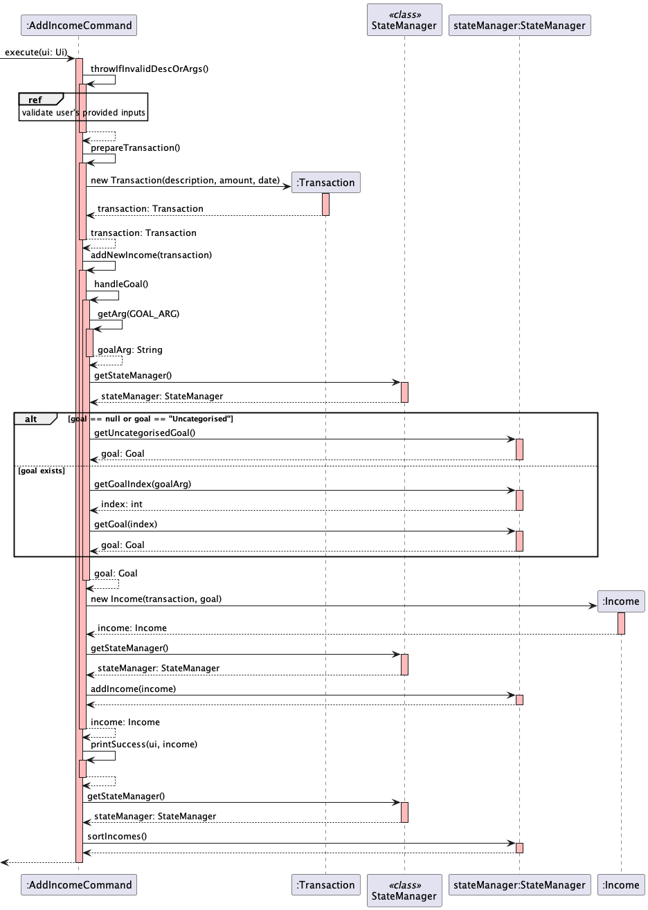

### Export feature

The export feature is facilitated by `CsvWriter` class which uses a third party library called OpenCSV. It implements the following operation:
- `exportTransactionData` - Converts each Transaction into an Array to be stored into the CSV File
- `exportIncomeData` - Exports all income transactions only
- `exportExpenseData` - Export all expense transactions only

Given below is an example usage scenario and how the export features behaves at each step.

Step 1. The user launches the application for the first time. There would be no transactions available to be exported.

Step 2. The user executes `in part-time job /amount 500 /goal car` to create a transaction with the description of `part-time job`, with the `amount` set to `500` and `goal` set to `car` and stores it in the program

Step 3. So when the user executes `export`, it will get all the transactions that the program stored and exports to a CSV file called `Transactions.csv`

However, if the user wishes to export only the income or expense transactions, the user could enter `export /type in` or `export /type out` respectively.

Below is the sequence diagrams for the export feature.

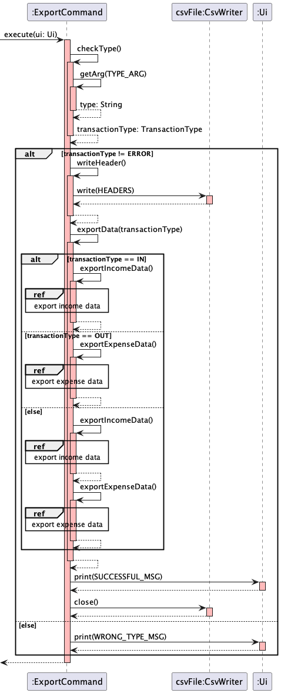

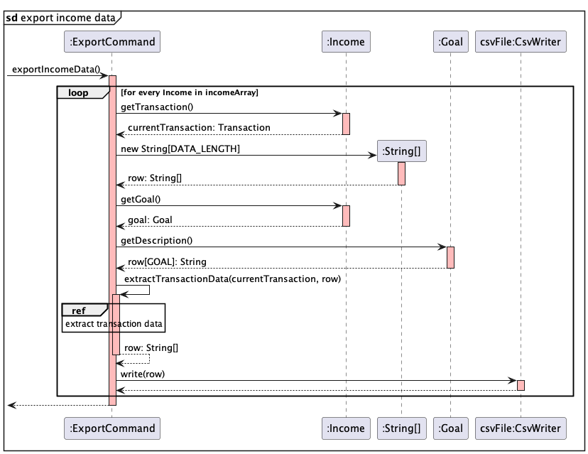

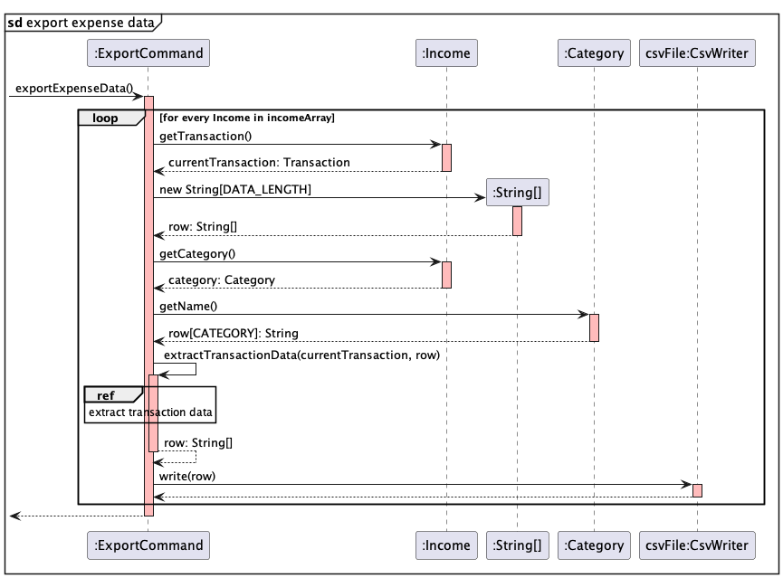

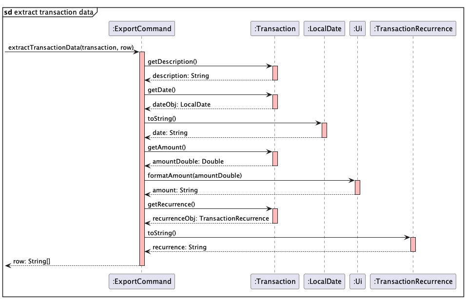

### Goal Feature

The goal feature is facilitated by `GoalCommand`, which extends `Command`. Based on the argument, either `/add` or `/remove`, 
the user can add a new goal or remove an existing goal. The main purpose of the goal feature is to tag each income transaction with 
a goal, such that the user can have a clear idea of how to plan his savings toward his personal goals.

If `/add` is provided, the command will validate the amount via 
`GoalCommand#validateAmount()` to ensure that the amount argument is present and valid. Then, `GoalCommand#addGoal` will be 
called to add the goal if the goal does not exist yet, else it will output an error message to inform the user that the goal already exist.

Else if `/remove` is provided, the command will call `GoalCommand#removeGoal` to check if the goal exists and remove it. Else, it will output 
an error message to inform the user that the goal does not exist.

Given below is an example usage scenario and how the goal feature behaves.

Step 1. The user launches the application for the first time. There will be no goal available.

Step 2. The user executes `goal /add car /amount 100000`, which will add a `car` goal, with the amount set to `100000`.

Step 3. The user executes `goal /remove car`, which will remove the newly added `car` goal.

Below is the sequence diagram for the goal feature.

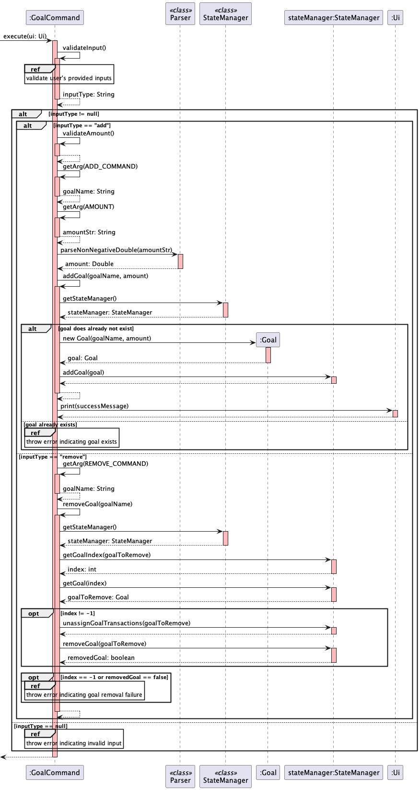

### Category Feature

The category feature is facilitated by `CategoryCommand`, which extends `Command`. Based on the argument, either `/add` or `/remove`,
the user can add a new category or remove an existing category. The main purpose of the category feature is to tag each expense transaction with
a category, such that the user can categorise his spending.

If `/add` is provided, `CategoryCommand#addCategory` will be
called to add the category if the category does not exist yet, else it will output an error message to inform the user that the category already exist.

Else if `/remove` is provided, the command will call `CategoryCommand#removeCategory` to check if the category exists and remove it. Else, it will output
an error message to inform the user that the category does not exist.

Given below is an example usage scenario and how the category feature behaves.

Step 1. The user launches the application for the first time. There will be no category available.

Step 2. The user executes `category /add food`, which will add a `food` category.

Step 3. The user executes `category /remove food`, which will remove the newly added `food` category.

Below is the sequence diagram for the category feature.

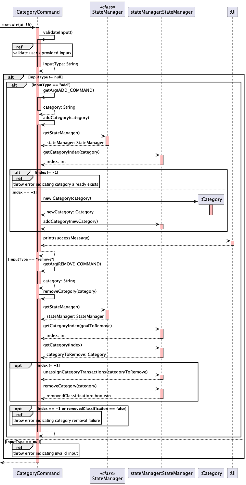

### Delete transaction feature

The delete transaction feature is facilitated by `RemoveTransactionCommand`, which extends `Command`. Based on the `/type` argument value, 
either the income or expense transaction will be removed. The transaction to be removed is based on the index supplied by the user, as shown 
when listing the income/expense transaction.

The command will call `RemoveTransactionCommand#removeTransaction()` which will get the maximum number of transaction from `RemoveTransactionCommand#getTransactionMaxSize()`, 
then parse the index supplied by the user and ensure is a valid integer using `RemoveTransactionCommand#parseIdx()`. This parsed index will then be used to remove the 
transaction from the `StateManager`. Afterward, `RemoveTransactionCommand#printSuccess()` will be called to print a success message
 to inform the user that the transaction has been removed.

Given below is an example usage scenario and how the delete transaction feature behaves.

Step 1. The user launches the application for the first time. There will be no transaction available.

Step 2. The user input `out dinner /amount 10` to add expense transaction.

Step 3. The user input `delete 1 /type out`. This will remove the first expense transaction, which is 
the transaction just added by the user.

Below is the sequence diagram for the delete transaction feature.

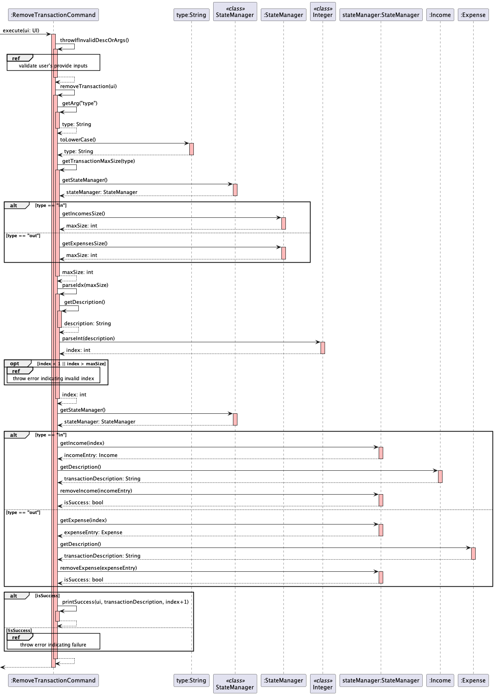

### Edit transaction feature

The edit transaction feature is facilitated by `EditTransactionCommand`, which extends `Command`. Based on the `/type` argument value,
either the income or expense transaction will be edited. User can edit the description, amount, goal (for income transaction) and category (for expense transaction). 
Date and recurrence of the transaction cannot be edited.

The command will first call `EditTransactionCommand#throwIfInvalidDescOrArgs()` to check that valid arguments and value are supplied by the user. Afterward, `EditTransactionCommand#editTransaction()`
will get the maximum number of transaction from `EditTransactionCommand#getTransactionMaxSize()`,
then parse the index supplied by the user and ensure is a valid integer using `EditTransactionCommand#parseIdx()`. This parsed index will then be used to update the
transaction from the `StateManager`. Afterward, `EditTransactionCommand#printSuccess()` will be called to print a success message
to inform the user that the transaction has been updated with the new values.

Given below is an example usage scenario and how the edit transaction feature behaves.

Step 1. The user launches the application for the first time. There will be no transaction available.

Step 2. The user input `out dinner /amount 10 /category food` to add expense transaction.

Step 3. The user input `edit 1 /type out /description lunch /amount 12 /category essentials`. This will edit the first expense transaction, which is
the transaction just added by the user. The new description will be `lunch`, amount `12` and category `essentials`.

### List feature
The list feature is facilitated by `ListCommand`, which extends `Command`. Depending on user input, the user would
be able to either view a summary of all current goals/categories and the progress towards a goal, or a list of all 
income or expense transactions, with options to filter the list to obtain a more specific view.

The command would first call `ListCommand#validateInput()`, which would validate if the user input is correct. If it is,
the program would then call `ListCommand#listTypeHandler()` to determine which path to take. This feature has 2 sub-features.

#### Sub-Feature 1: Listing of goals and categories

After the program reaches `ListCommand#listTypeHandler()`, it would call `ListCommand#printTypeStatus()` to prepare a list
of either goals or categories depending on the user input. The program would then call either `UI#printGoalsStatus()`
or `UI#printCategoryStatus()`.

#### Sub-Feature 2: Listing of transactions

After the program reaches `ListCommand#listTypeHandler()`, depending on the user input to print either income or expenses, the program would first call `ListCommand#checkInArgs()` to validate the arguments and then `ListCommand#listIncome()`.
Alternatively, it would call `ListCommand#checkOutArgs()` followed by `ListCommand#listExpenses`.
If filters are specified, the program may either call `ListCommand#filterGoal()`, `ListCommand#filterIncome()` to filter the income transaction list, or
`ListCommand#filterCategory()` and `ListCommand#filterExpense()` for filtering of the expense transaction list. Finally, it would call `ListCommand#printList()`, which would 
call `UI#listTransactions()` to print the transactions list.

Given below is an example usage scenario:

Step 1. This is made with the assumption that the user has added a few transactions to the program.

Step 2. The user inputs `list /goal` to list all goals in the program

Step 3. The program would calculate how much does each goal current have.

Step 4. The program would then return a list of all goals that has some progress towards it, followed by uncategorised goals,
where transactions were added without a goal listed, and a list of unused goals.

Below is the ListCommand sequence diagram:
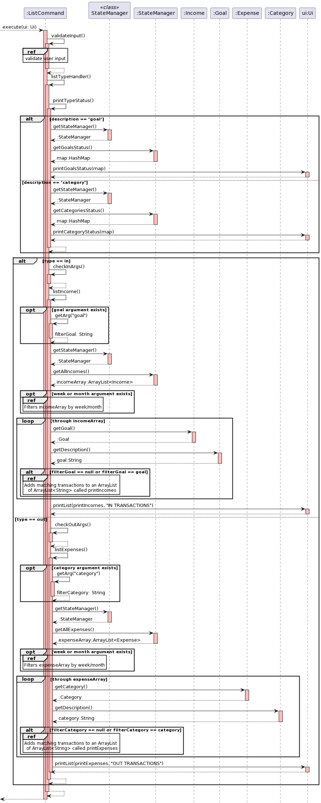

### Summary feature

The summary feature is facilitated by `SummaryCommand`, which extends `Command`. Based on the arguments, `/day`, `/week` or `/month`, 
the user can choose to filter and summarise the total sum of the income or expense transactions by the current day, week, or month. 

The command will first call `SummaryCommand#getFilter()` to get the filter type indicated by the user if any. Then, based on the `/type` argument value supplied by the user, `SummaryCommand#printSummary` will 
call either `SummaryCommand#getIncomeSummary()` or `SummaryCommand#getExpenseSummary()`, which will get the filtered income or expense arraylist from `SummaryCommand#filterIncome()` or `SummaryCommand#filterExpense()`. 

The filtered arraylist will then be looped to sum up the total amount. This total amount will be passed to `SummaryCommand#getSummaryMsg()` to format the message to be printed by `ui`.

Given below is an example usage scenario and how the summary feature behaves.

Step 1. Assume that the user has been using the program for some time. There will be a few income and expense transactions available.

Step 2. The user input `summary /type in /day`.

Step 3. The program will filter all the income transaction by the current date, and sum up the total amount.

Step 4. The total amount will be output.

Below is the sequence diagram for the summary feature.

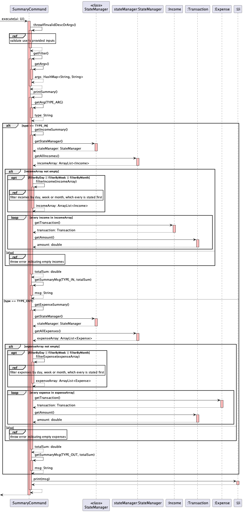

## Product scope

### Target user profile

 Users who prefer a CLI interface over a GUI and want to better manage their finances to gauge their financial health.

### Value proposition

Personal finance tracker to make it easy for users to track and manage their saving/spending, \
and view a summary of their daily/weekly/monthly transactions.

## User Stories

|Version| As a ... | I want to ...                                                         | So that I can ...                                                   |
|--------|----------|-----------------------------------------------------------------------|---------------------------------------------------------------------|
|v1.0|user| add a new income source                                               | can keep track of my allowances and part-time job earnings          |
|v1.0|user| add an expense                                                        | can monitor my purchases and stay within my budget                  |
|v1.0|user| delete a transaction                                                  | remove any duplicate or unwanted entries from my expenses           |
|v1.0|user| view a list of all my transactions                                    | review my income and expenses                                       |
|v2.0|user| export financial data to a CSV file                                   | use it for client presentations and analysis                        |
|v2.0|user| set up recurring transactions for mortgage payments and utility bulls | easily track and budget for regular home expenses                   |
|v2.0|user| set financial goals, such as saving for a down payment on a house     | stay motivated and track my progress towards home ownership.        |
|v2.0|user| categorise my spending                                                | to group similar spendings together                                 |
|v2.0|user| edit my transaction                                                   | to rectify any mistakes I made when inputing the transaction details |
|v2.0|user| view a summary of my income and expense transactions                  | know my current saving and spending                                 |

## Non-Functional Requirements

- The program work on any mainstream OS with Java 11.
- The program should provide a consistent experience across the different platforms as far as possible.
- The program should be able to work locally without internet connectivity.
- The program should be intuitive to use.

## Glossary

| Terms         | Definition                                   |
|---------------|----------------------------------------------|
| Mainstream OS | Windows, Linux, Unix, OS-X                   |

## Instructions for manual testing

Listed below are the steps to test the program manually.

### Launching and exiting the program
1. Launching program
   1. Download the jar file and store it in a new folder.
   2. Run the jar file using `java -jar FinText.jar` (Where FinText.jar is the jar file name)
   3. You will be greeted with a welcome message.
2. Exiting the program
   1. Input `bye` to exit the program safely.

### Adding an income transaction
1. Adding an income transaction.
   1. Test case: `in angbao /amount 100`  
   Expected: An income transaction is being tracked with the description `angbao`, amount `100.00`, date will be the 
   current date, goal `Uncategorised` and recurrence `none`.
2. Adding an income transaction with a specific date.
   1. Test case: `in angbao /amount 100 /date 10112023`  
      Expected: An income transaction is being tracked with the description `angbao`, amount `100.00`, date
      `2023-11-10`, goal `Uncategorised` and recurrence `none`.
3. Adding an income transaction with a specific date and goal.
   1. Prerequisite: A goal `car` must be added first.
   2. Test case: `in angbao /amount 100 /date 10112023 /goal car`  
       Expected: An income transaction is being tracked with the description `angbao`, amount `100.00`, date
       `2023-11-10`, goal `car` and recurrence `none`.
4. Adding an income transaction with a specific date, goal and recurring monthly.
   1. Prerequisite: A goal `car` must be added first.
   2. Test case: `in salary /amount 3000 /date 10112023 /goal car /recurrence monthly`  
      Expected: An income transaction is being tracked with the description `salary`, amount `3000.00`, date
      `2023-11-10`, goal `car` and recurrence `monthly`.

### Adding an expense transaction
1. Adding an expense transaction.
   1. Test case: `out dinner /amount 10`  
      Expected: An expense transaction is being tracked with the description `dinner`, amount `10.00`, date will be the
      current date, category `Uncategorised` and recurrence `none`.
2. Adding an expense transaction with a specific date.
   1. Test case: `out dinner /amount 10 /date 10112023`  
      Expected: An expense transaction is being tracked with the description `dinner`, amount `10.00`, date
      `2023-11-10`, category `Uncategorised` and recurrence `none`.
3. Adding an expense transaction with a specific date and category.
   1. Test case: `out dinner /amount 10 /date 10112023 /category food`  
      Expected: An expense transaction is being tracked with the description `dinner`, amount `10.00`, date
      `2023-11-10`, category `food` and recurrence `none`.
4. Adding an expense transaction with a specific date, category and recurring daily.
   1. Test case: `out dinner /amount 10 /date 10112023 /category food /recurrence daily`  
      Expected: An expense transaction is being tracked with the description `dinner`, amount `10.00`, date
      `2023-11-10`, category `food` and recurrence `daily`.

### Deleting a transaction
1. Deleting an income transaction
   1. Prerequisite: Ensure there is at least 1 income transaction added.
   2. Test Case: `delete 1 /type in`  
      Expected: The first income shown when listing income transactions is deleted.
   3. Test Case: `delete x /type in` (Where `x` is a number greater than the total number of income transactions, or
   less than 1, or is not a number)  
      Expected: A error message will be shown to input valid index.
   4. Test Case: `delete 1`  
   Expected: A error message will be shown to indicate the transaction type.
2. Deleting an expense transaction
   1. Prerequisite: Ensure there is at least 1 expense transaction added.
   2. Test Case: `delete 1 /type out`  
      Expected: The first expense shown when listing expense transactions is deleted.
   3. Test Case: `delete x /type in` (Where `x` is a number greater than the total number of expense transactions, or
      less than 1, or is not a number)  
      Expected: A error message will be shown to input valid index.
   4. Test Case: `delete 1`  
      Expected: A error message will be shown to indicate the transaction type.

### Listing transactions
1. Listing income transactions
   1. Prerequisite: Ensure there is at least 1 income transaction added. A goal `car` is added.
   2. Test Case: `list /type in`  
      Expected: All income transactions will be listed.
   3. Test Case: `list /type in /goal car`  
      Expected: Only income transactions with the goal `car` will be listed.
   4. Test Case: `list /type in /goal car /week`  
      Expected: Only income transactions with the goal `car` and within the current week will be listed.

2. Listing expense transactions
   1. Prerequisite: Ensure there is at least 1 expense transaction added.
   2. Test Case: `list /type out`  
      Expected: All expense transactions will be listed.
   3. Test Case: `list /type out /category food`  
      Expected: Only expense transactions with the category `food` will be listed.
   4. Test Case: `list /type out /category food /week`  
      Expected: Only expense transactions with the category `food` and within the current week will be listed.

### Adding goal
1. Adding goal
   1. Test Case: `goal /add car /amount 1000000`  
   Expected: Goal `car` is added with the amount `1000000`.
   2. Test Case: `goal /add car` (Missing `/amount`)  
   Expected: Error message is shown with the correct usage of the command.

### Removing goal
1. Removing goal
   1. Prerequisite: Ensure that goal `car` is added.
   2. Test Case: `goal /remove car`  
      Expected: Goal `car` is removed. All income transaction with goal `car`, will be changed to goal `Uncategorised`.

### Adding category
1. Adding category
   1. Test Case: `category /food`  
      Expected: Category `food` is added.

### Removing category
1. Removing category
   1. Prerequisite: Ensure that category `food` is added.
   2. Test Case: `category /remove food`  
      Expected: Category `food` is removed. All expense transaction with category `food`, will be changed to category `Uncategorised`.

### Editing a transaction
1. Editing an income transaction
   1. Prerequisite: Ensure that there is at least one income transaction. `car` goal is added.
   2. Test Case: `edit 1 /type in /description New Edited Description`  
   Expected: The description of the first income transaction shown when listing income transactions will be changed to 
   `New Edited Description`.
   3. Test Case: `edit 1 /type in /amount 1234`  
      Expected: The amount of the first income transaction shown when listing income transactions will be changed to
      `1234.00`.
   4. Test Case: `edit 1 /type in /description New Edited Description /amount 1234 /goal car`  
         Expected: The first income transaction will be changed to description `New Edited Description`, amount `1234.00`, goal `car`.
2. Editing an expense transaction
   1. The output will be similar to editing income transaction, with type `out`. Instead of `goal`, `category` is edited instead.

### Summarise the transaction total
1. Summarise income transactions
   1. Prerequisite: Ensure that there is at least one income transaction.
   2. Test Case: `summary /type in`  
   Expected: Show the total sum of income transactions.
   3. Test Case: `summary /type in /day`  
      Expected: Show the total sum of income transactions that are transacted in the current day.
   4. Test Case: `summary /type in /week`  
      Expected: Show the total sum of income transactions that are transacted in the current week.
   5. Test Case: `summary /type in /month`  
      Expected: Show the total sum of income transactions that are transacted in the current month.
2. Summarise expense transactions
   1. Prerequisite: Ensure that there is at least one expense transaction.
   2. Test Case: `summary /type out`  
      Expected: Show the total sum of expense transactions.
   3. Test Case: `summary /type out /day`  
      Expected: Show the total sum of expense transactions that are transacted in the current day.
   4. Test Case: `summary /type out /week`  
      Expected: Show the total sum of expense transactions that are transacted in the current week.
   5. Test Case: `summary /type out /month`  
      Expected: Show the total sum of expense transactions that are transacted in the current month.

### Exporting transaction
1. Exporting transactions
   1. Test Case: `export`  
   Expected: All transactions will be exported to a file `Transactions.csv`
   2. Test Case: `export /type in`  
      Expected: Only income transactions will be exported to a file `Transactions.csv`
   3. Test Case: `export /type out`  
      Expected: Only expense transactions will be exported to a file `Transactions.csv`

### Help
1. Help
   1. Test Case: `help`  
   Expected: Show all the available commands and description of each command
   2. Test Case: `help x` (Where `x` is the command)  
   Expected: Show the usage and options of the command.