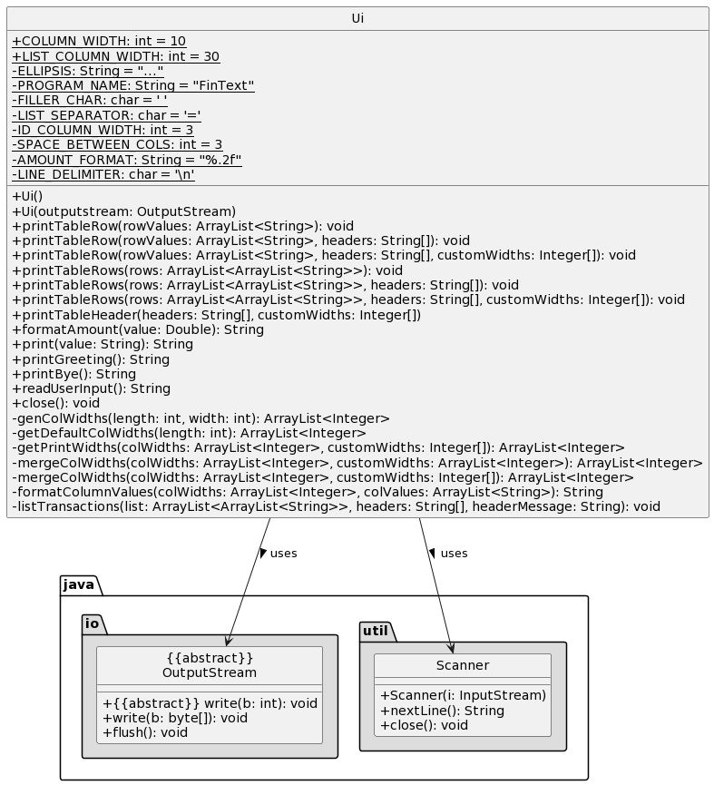

# Developer Guide

## Acknowledgements

1. [OpenCSV](https://mvnrepository.com/artifact/com.opencsv/opencsv)
2. [Apache Common IO](https://mvnrepository.com/artifact/commons-io/commons-io)

## Design

### Architecture

The bulk of the app's work is done by the following four components:
- `UI`: The UI of the App.
- `Parser`: Formats the user's input.
- `Command`: Command's logic and execution.
- `Storage`: Storage of data of the App.

### UI component

The `UI` consists of a `Scanner` and an `OutputStream` object. Together, these objects abstract the functionalities of
obtaining user input and providing feedback (output printed in terminal UI). The `UI` component provides a simple
interface for other components to interact with the user.

The `UI` component:
- provides a method to obtain user input.
- provide methods to print output in tabular format

### Parser component

The `Parser` functionality is to take in a user input, parse it and return the relevant `Command` object based on 
the input.

How the `Parser` works:
1. When the user input any string, it will be passed to a newly constructed `Parser` object.
2. The `parse` function in the `Parser` will be called to extract the command word, description and arguments of the 
command if any.
3. These parsed details will then be passed to the relevant `Command` object based on the command word.
4. Afterward, the `Command` object will be passed back to `Main` for execution.

Note: The `Parser` will not do any validation of arguments or description of the command. Those will be handled by the 
respective `Command` object.

### Command component

The Command component consists of the individual command objects (listed in table below) and an abstract
class `Command`. The `Command` component is responsible for executing the commands after it has been parsed by `Parser`. \
All error handling is handled here and any errors/output would be passed to the `UI` component for printing and
formatting of the output.

| Command                  | Purpose                                    |
|--------------------------|--------------------------------------------|
| AddExpenseCommand        | Add a new Expense transaction              |
| AddIncomeCommand         | Add a new Income transaction               |
| CategoryCommand          | Add/Remove a Category (used for expense)   |
| ExitCommand              | Exit the program                           |
| GoalCommand              | Add/Remove a Goal (used for income)        |
| HelpCommand              | Gives usage format information to the user |
| ListCommand              | Lists all incoming/outgoing transactions   |
| ExportCommand            | Exports transactions data into CSV FIle.   |
| RemoveTransactionCommand | Deletes a transaction                      |
| EditTransactionCommand   | Edits an income/expense transaction        |

### Storage component
The `Storage` functionality is to load data from the storage files (`category-store.csv` , `expense-store.csv`, `goal-store.csv`, `income-store.csv`) into the application. It will also stores any data while the application is running.

The `Storage` component:
- Ensures that all the data that is loaded is able to be parsed properly and stored in the application when booting up
- Skips any rows that have issue during the validation phase
- Saves to storage file after each command completed
- uses `CsvWriter` and `CsvReader` class to read and write to the storage files.
- `CsvWriter` and `CsvReader` will use `CSVWriter` and `CSVReader` respectively from OpenCSV library to write and read from CSV Files 

## Common Classes
### Income Class
Income class is used to store information of the savings of the user. It is implemented by the aggregation of 
Transaction and Goal classes. Each income is linked to one transaction and goal. The goal is a target set by 
the user for which the money is saved for.

### Expense Class
Expense class is used to store information of the spending of the user. It is implemented by the aggregation of 
Transaction and Category classes. Each expense is linked to one transaction and category. The category is used for 
grouping of related spending such as Food, Transport, School Fees, etc.

## Implementation

### Export feature

The export feature is facilitated by `CsvWriter` class which uses a third party library called OpenCSV. It implements the following operation:
- `exportTransactionData` - Converts each Transaction into an Array to be stored into the CSV File
- `exportIncomeData` - Exports all income transactions only
- `exportExpenseData` - Export all expense transactions only

Given below is an example usage scenario and how the export features behaves at each step.

Step 1. The user launches the application for the first time. There would be no transactions available to be exported.

Step 2. The user executes `in part-time job /amount 500 /goal car` to create a transaction with the description of `part-time job`, with the `amount` set to `500` and `goal` set to `car` and stores it in the program

Step 3. So when the user executes `export`, it will get all the transactions that the program stored and exports to a CSV file called `Transactions.csv`

However if the user wishes to export only the income or expense transactions, the user could enter `export /type in` or `export /type out` respectively.
## Product scope

### Target user profile

 Users who prefer a CLI interface over a GUI and want to better manage their finances to gauge their financial health.

### Value proposition

Personal finance tracker to make it easy for users to track and manage their spending, \
and generate daily/weekly/monthly reports to break down how they spend (e.g. spending categories, \
whether they spend above their income, etc).

## User Stories

|Version| As a ... | I want to ... | So that I can ...|
|--------|----------|---------------|------------------|
|v1.0|user|add a new income source|can keep track of my allowances and part-time job earnings|
|v1.0|user|add an expense|can monitor my purchases and stay within my budget|
|v1.0|user|delete a transaction|remove any duplicate or unwanted entries from my expenses|
|v1.0|user|view a list of all my transactions|review my income and expenses|
|v2.0|user|export financial data to a CSV file|use it for client presentations and analysis|
|v2.0|user|set up recurring transactions for mortgage payments and utility bulls|easily track and budget for regular home expenses|
|v2.0|user|set financial goals, such as saving for a down payment on a house|stay motivated and track my progress towards home ownership.|

## Non-Functional Requirements

{Give non-functional requirements}

## Glossary

* *glossary item* - Definition

## Instructions for manual testing

{Give instructions on how to do a manual product testing e.g., how to load sample data to be used for testing}
